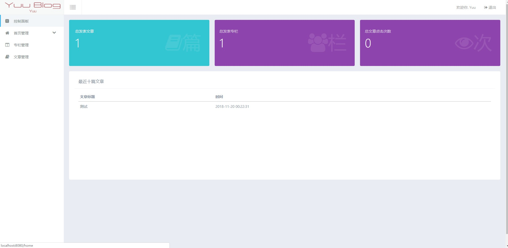
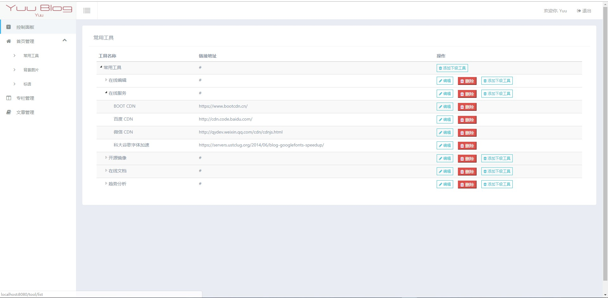
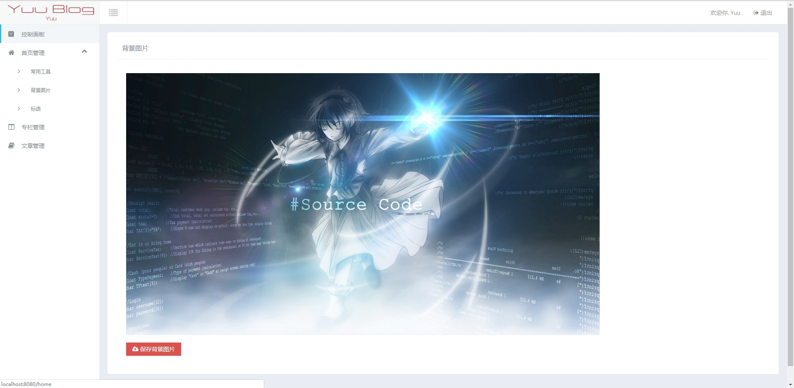
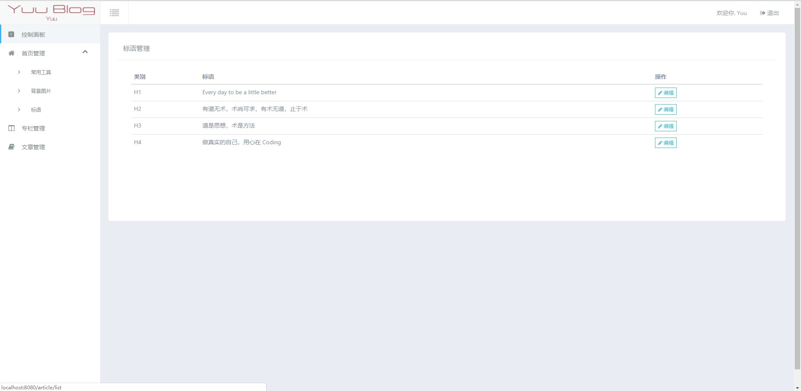
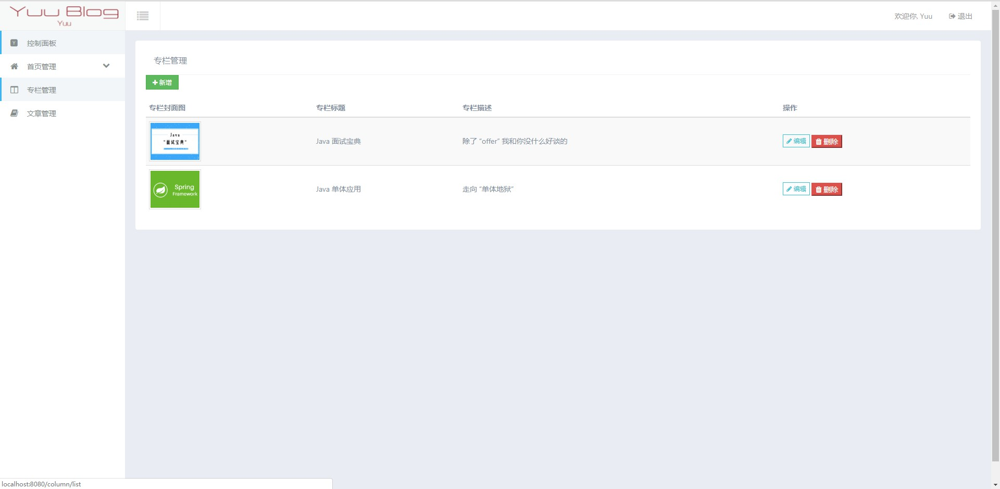
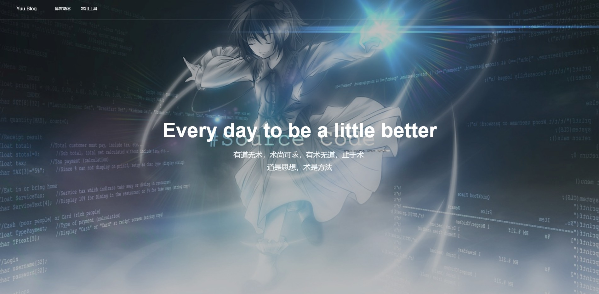
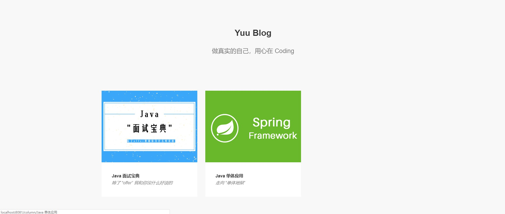
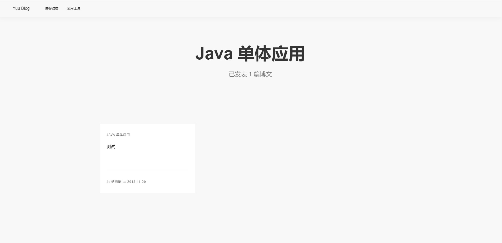
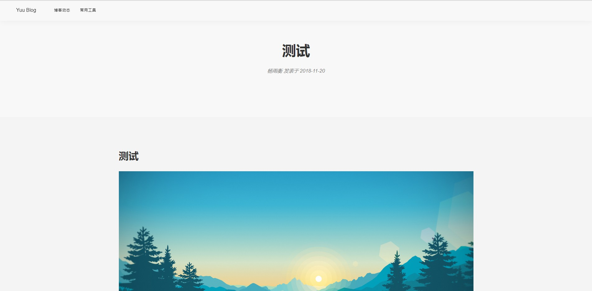

## Yuu Blog

这是一个使用 Maven 构建的多模块化的 SSM（Spring + Spring MVC + MyBatis）项目。

## 开发环境

- Intellij IDEA 2018.3.24
- JDK 8
- Tomcat 8
- MySql 5.7

## 项目截图

### 后台管理系统

- 后台首页

- 工具管理

- 背景图片管理

- 标语管理

- 专栏管理

- 文章管理

### 前台系统

- 首页

- 专栏

- 专栏文章

- 文章页

